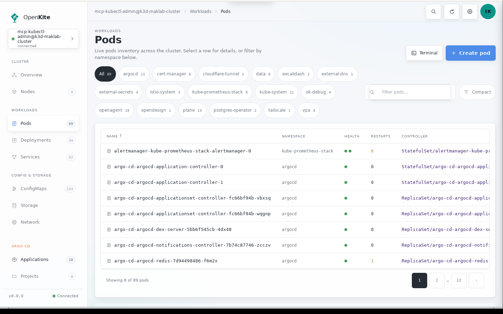
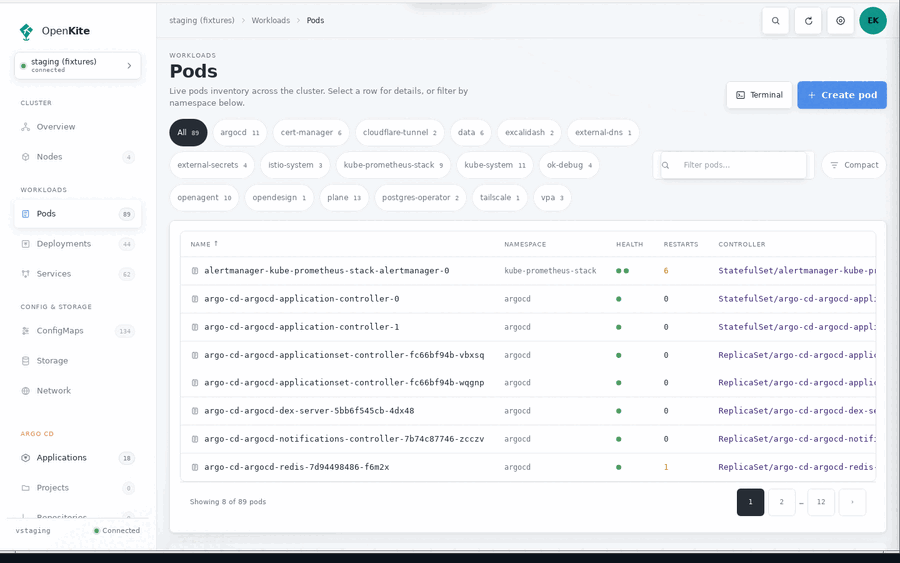
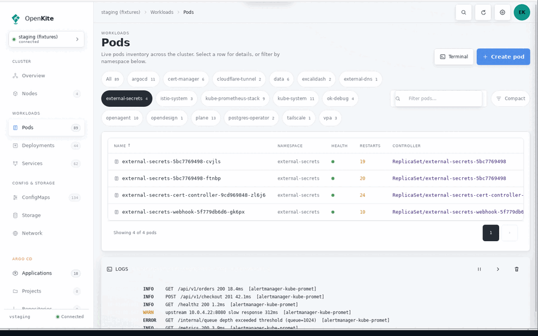
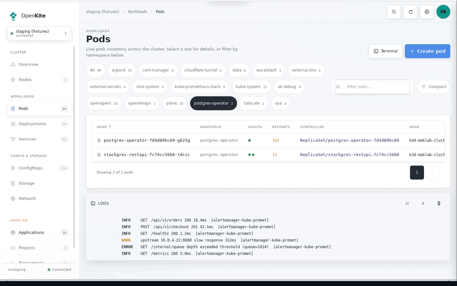
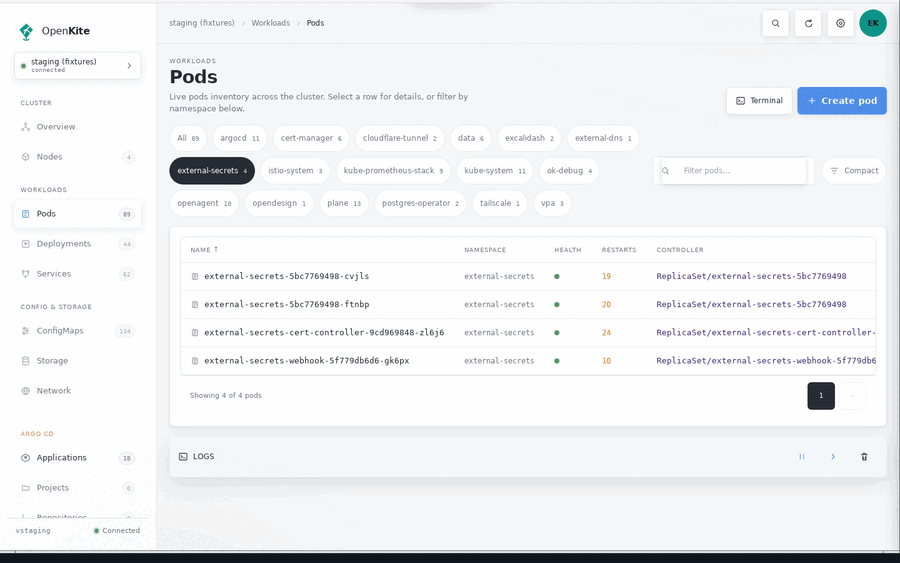
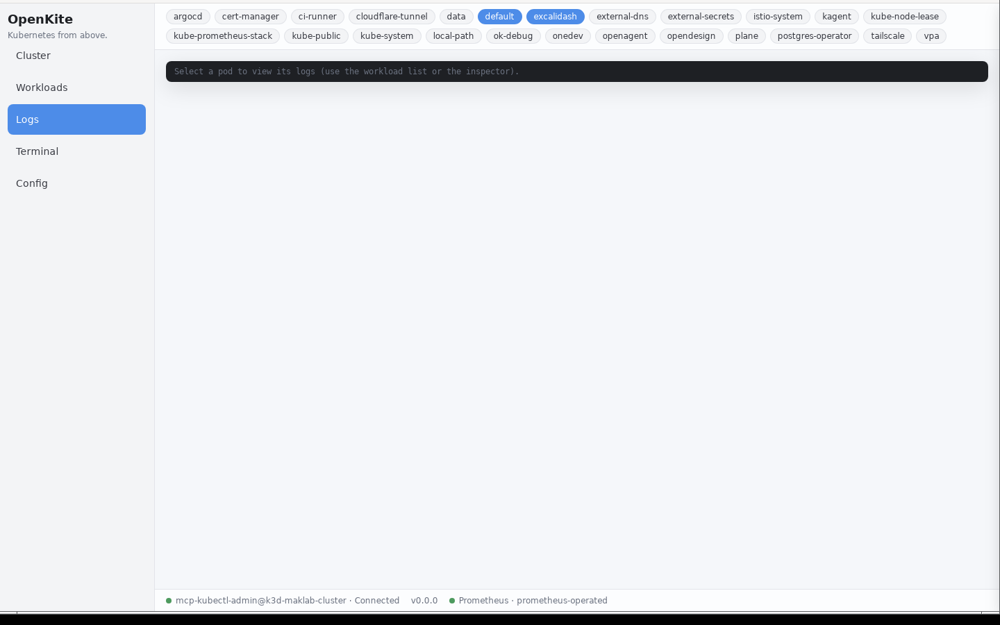
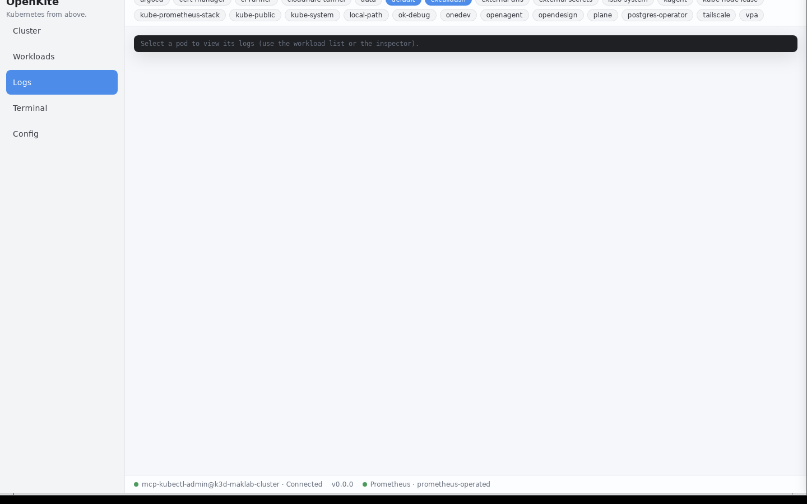
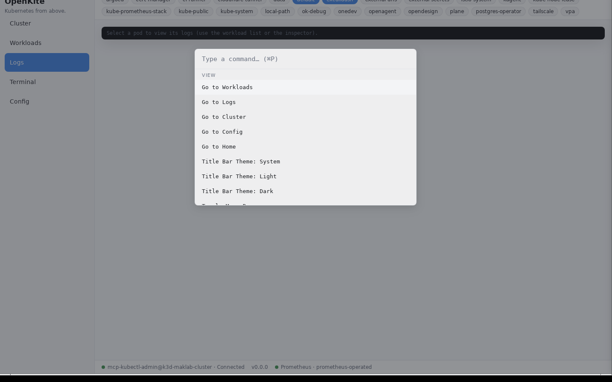

<div align="center">
  <h1>OpenKite</h1>
  <p><em>Kubernetes from above.</em></p>

  <p align="center">
    
    
    
    
  </p>
</div>

## Quick Links

- [What is it?](#what-is-it) · [Features](#features) · [Visual tour](#visual-tour) · [Quickstart](#quickstart) · [Documentation](#documentation) · [Contributing](#contributing)

## What is it?

OpenKite is an open-source Kubernetes IDE in pure Rust — Dioxus 0.7 (desktop)
with kube-rs 4. One language, one binary, desktop-first.

## Features

- **Cluster connect** — kubeconfig loading, multi-context switching
- **Resource views** — Pods, Deployments, Services, ConfigMaps, Secrets, DaemonSets, StatefulSets, ReplicaSets, Jobs, CronJobs
- **Virtualized tables** — sortable, filterable, windowed (reflector-backed live state)
- **Pod detail** — containers, status, events
- **Log viewer** — follow/pause, capped buffer
- **Secret redaction** — masked by default, explicit reveal
- **Theme engine** — 5 built-in themes + Zed JSON import
- **Command palette** — fuzzy matcher (Cmd+P / Ctrl+P)
- **Metrics** — sparklines (metrics-server) + auto-detected Prometheus
- **Plugin system** — `openkite-plugin-sdk`, static-first (dylib experimental)

> YAML editor (CodeMirror 6) and embedded terminal (portable-pty + xterm.js)
> are in progress — see the [board](https://plane.maklab.net/maklab/projects/71ba0e95-7c1a-4ea6-a50a-c42b0591492f).

## Visual tour

Every image below is the real wry/WebKitGTK webview on a live cluster, captured
by the in-cluster harness in [`dev/capture/`](dev/capture/) — no mockups.

### Console shell chrome

252px sidebar with live count badges, cluster selector, breadcrumb topbar and connection status.



### Resource table

Nine sortable columns, namespace chips, search, compact density and a windowed pager, live from the reflector.


### Inspector slide-over

Select a row to open the resource summary over the current view; the scrim or Escape closes it.



### Log dock

Inline pod logs with pause, collapse and clear actions.



### Toasts

Refreshing resources raises a transient acknowledgement that auto-dismisses.



### Command palette

Cmd+P / Ctrl+P opens the fuzzy command palette over the console; Escape closes it.



### Native chrome settings

The OS menu bar can be hidden from the palette, and the title-bar theme overrides the OS decoration.

Menu bar shown at startup (left) and hidden by `View: Toggle Menu Bar` (right):




`Title Bar Theme: System | Light | Dark` changes native decorations only. The
headless capture window manager does not paint the decoration theme, so the
System/Light/Dark stills are pixel-identical; this one needs re-capturing on a
real desktop.



## Install

Prebuilt binaries land on the [Releases page](https://github.com/jomakori/openkite/releases) for every version. Install via your platform's package manager:

**macOS (Homebrew cask — Apple Silicon + Intel)**

```sh
brew tap jomakori/homebrew-tap
brew install --cask openkite
```

**Linux (Homebrew formula — builds from source, any arch)**

```sh
brew tap jomakori/homebrew-tap
brew install openkite
```

**Windows (Chocolatey via GitHub Packages — amd64 + arm64)**

```sh
choco source add -n openkite-gh -s "https://nuget.pkg.github.com/jomakori/index.json" --priority 1
choco install openkite
```

> The brew cask + formula live in the [jomakori/homebrew-tap](https://github.com/jomakori/homebrew-tap) repo and auto-update on every release. GitHub Packages NuGet feeds require authentication for `choco source add` — use a [PAT](https://github.com/settings/tokens) with `read:packages` when prompted, or set `GH_TOKEN`. Releases are also downloadable directly from the [Releases page](https://github.com/jomakori/openkite/releases) (AppImage / DMG / NSIS `.exe` / `.nupkg`).

## Quickstart

```sh
# Desktop dev loop (hot reload)
cargo install dioxus-cli
dx serve

# Or via Tilt + ephemeral k3d cluster
k3d cluster create openkite-dev --registry-create openkite-registry:5050
tilt up

# Plain build
cargo build --release
```

## Documentation

- [Architecture](docs/architecture.md)
- [Plugin development](docs/plugin-development.md)
- [Theming](docs/theming.md)
- [Contributing](CONTRIBUTING.md)

## License

MIT + Apache-2.0 (dual) — see `LICENSE-MIT` and `LICENSE-APACHE`.
